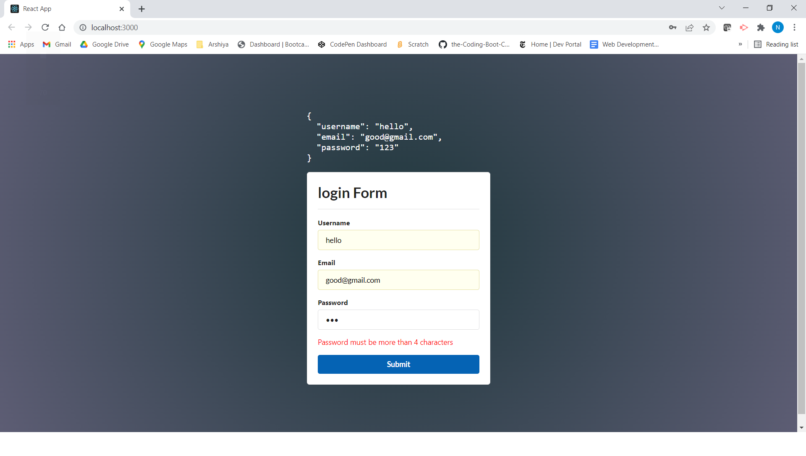
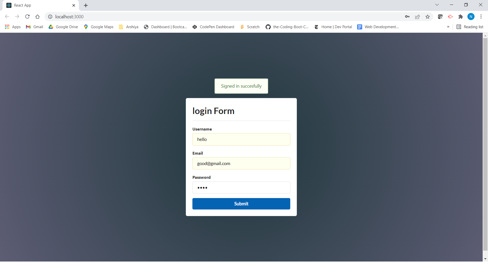

# About

**Developed** a basic React Form Validation Application.
I have completed a React course From the CodeAcademy platform 
to brush up my React skills and to get more hands on knowledge
by practising and learning the skills. Now, i can say that I have good knowledge of functional and class components. Also, more clarity in using **React Hooks**. 

# Description
In this application,in this have to enter in the input 
fields and all the fields have certain criteria. If the user ,
will not be able to fulfill the conditions which are set for 
validation of the form, form will show us the message. If user,
is successful in filling out the provided fields according 
to the Validation , then form signed in successfully message 
will pop up on the screen.

# TABLE OF CONTENTS
[ Description](#Description)

[INSTALLATION](#INSTALLATION)

[TEXT-EDITOR](#TEXT-EDITOR)

[PROGRAMMING-LANGUAGE](#PROGRAMMING-LANGUAGE)

[RESOURCES-REFERRED](#RESOURCES-REFERRED)

[SCREENSHOT](#SCREENSHOT)

[GIT_HUB-REPOSITORY](#GIT_HUB-REPOSITORY)

[GIT_HUB-Deployed-Link](#GIT_HUB-Deployed-Link)

## TEXT-EDITOR
**Vs-code**

## PROGRAMMING-LANGUAGE

CSS

JAVASCRIPT

React 

# RESOURCES-REFERRED
[Tutorial](https://www.youtube.com/watch?v=B3pmT7Cpi24&t=303s)

[MVC](https://www.youtube.com/watch?v=sSLGP-_2gOI)

# SCREENSHOT

# GIT_HUB-REPOSITORY
[GIT-HUB](https://github.com/nehreetkaur/React-Form)

# GIT_HUB-Deployed-Link
[GIT-HUB](https://nehreetkaur.github.io/Javascript-game/)